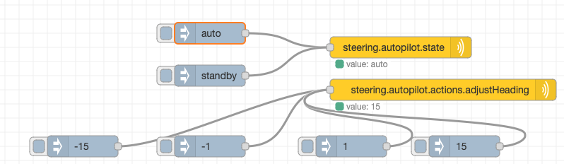
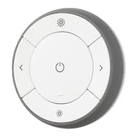
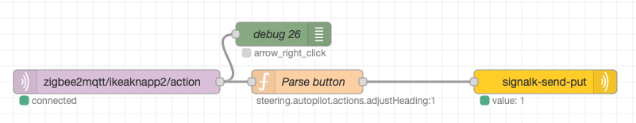

## Introduction

`signalk-autopilot-garmin` is a plugin for the Signal K server that provides limited support for controlling a Garmin Reactor autopilot. This plugin allows users to set the autopilot state and adjust heading via Signal K PUT requests.

**Compatibility Note**: This plugin is tested with Signal K Server version 2.6.2 only. 

## Tested Hardware

- Reactor™ 40 CCU
- GHC-20

NMEA2000 connection via an [YDEN-02](https://www.yachtdevices.com.au/nmea-2000-ethernet-gateway-yden-02/)

Note that a GHC-20 or GHC-50 needs to be installed in the system following Garmins recommendations.


## Alpha Version Warning

**Caution**: This is an alpha version of the software. Use with caution as there may be bugs and incomplete features. We welcome bug reports and feature requests on our [GitHub issues page](https://github.com/jorgen-k/signalk-autopilot-garmin/issues).

## Getting Started

### Installation

Install the plugin via appstore in your SignalK server. Do not forget to activate it by pressing submit in the settings. Default settings are probably good enough.

### Configuration Options

- `deviceID`: The NMEA 2000 device ID of your Garmin Reactor.

# Current State

The current state of the autopilot is *not implemented* in SignalK, since the Garmin proprietary NMEA PGNS's has not been reveresed engineered. When possible, it will later be found at the following paths to be compatible with other autopilots:

- steering.autopilot.target.headingMagnetic
- steering.autopilot.target.windAngleApparent
- steering.autopilot.state (standby, wind, route, or auto)

Inm the meantime you *must use your physical instruments*, a GHC-20 or similar, to check the state of the autopilot.

# API

All messages to plugin are done using PUT requests. These can be done via HTTP or over WebSockets.

Detailed info on [PUT](https://signalk.org/specification/1.7.0/doc/put.html) and [Request/Response](https://signalk.org/specification/1.7.0/doc/request_response.html)

This is *not* the new V2 API for autopilots. Will be available when it is available for the server. 

## Set Autopilot State

The `value` can be `auto` or `standby`. The states `wind` and `route` is *not yet supported* but might or will be in the future.

```
PUT http://localhost:3000/signalk/v1/api/vessels/self/steering/autopilot/state
{
  "value": "auto"
}
```

Increase/decrease of heading is supported with steps of 1 or 15 degrees. The autopilot must be in auto state for this to work.

```
PUT http://localhost:3000/signalk/v1/api/vessels/self/steering/actions/adjustHeading
{
  "value": -15
}
```
# Node Red examples

For all Node Red examples you will need the [Node Red Embedded](https://flows.nodered.org/node/@signalk/node-red-embedded) plugin, and of course a SignalK server with the signalk-autopilot-garming plugin installed.

## Basic example
This example just makes it possible to steer the autopilot within node red.



Copy the code below and import it on your Node Red flow.


```
[{"id":"89bfdf6ecf138fd7","type":"signalk-send-put","z":"a1870b249fca0745","name":"steering.autopilot.state","path":"steering.autopilot.state","source":"","x":640,"y":580,"wires":[]},{"id":"1550a9a2dbee677f","type":"inject","z":"a1870b249fca0745","name":"","props":[{"p":"payload"},{"p":"topic","vt":"str"}],"repeat":"","crontab":"","once":false,"onceDelay":0.1,"topic":"","payload":"auto","payloadType":"str","x":370,"y":560,"wires":[["89bfdf6ecf138fd7"]]},{"id":"3bcc6dad9de3651f","type":"inject","z":"a1870b249fca0745","name":"","props":[{"p":"payload"},{"p":"topic","vt":"str"}],"repeat":"","crontab":"","once":false,"onceDelay":0.1,"topic":"","payload":"standby","payloadType":"str","x":370,"y":620,"wires":[["89bfdf6ecf138fd7"]]},{"id":"50a60afdbc532917","type":"signalk-send-put","z":"a1870b249fca0745","name":"steering.autopilot.actions.adjustHeading","path":"steering.autopilot.actions.adjustHeading","source":"","x":700,"y":640,"wires":[]},{"id":"448b78182c9e19e3","type":"inject","z":"a1870b249fca0745","name":"","props":[{"p":"payload"},{"p":"topic","vt":"str"}],"repeat":"","crontab":"","once":false,"onceDelay":0.1,"topic":"","payload":"-1","payloadType":"num","x":370,"y":720,"wires":[["50a60afdbc532917"]]},{"id":"b254011bd834027e","type":"inject","z":"a1870b249fca0745","name":"","props":[{"p":"payload"},{"p":"topic","vt":"str"}],"repeat":"","crontab":"","once":false,"onceDelay":0.1,"topic":"","payload":"-15","payloadType":"num","x":190,"y":720,"wires":[["50a60afdbc532917"]]},{"id":"98fa871bec05006f","type":"inject","z":"a1870b249fca0745","name":"","props":[{"p":"payload"},{"p":"topic","vt":"str"}],"repeat":"","crontab":"","once":false,"onceDelay":0.1,"topic":"","payload":"1","payloadType":"num","x":570,"y":720,"wires":[["50a60afdbc532917"]]},{"id":"c5f78382b24c89ff","type":"inject","z":"a1870b249fca0745","name":"","props":[{"p":"payload"},{"p":"topic","vt":"str"}],"repeat":"","crontab":"","once":false,"onceDelay":0.1,"topic":"","payload":"15","payloadType":"num","x":730,"y":720,"wires":[["50a60afdbc532917"]]}]
```


## Remote control 
This example makes it possible to control the autopilot via a remote control. I choosed an Ikea Tradfri remote that has five buttons, but of course you can choose any and adjust as necessary. The Ikea Tradfri is integrated to node red via mqtt and zigbee2mqtt.

And for a couple of dollars I have a remote to my autopilot! 





Copy the code below and import it on your Node Red flow.


```
[{"id":"041587e12d665eac","type":"mqtt in","z":"a1870b249fca0745","name":"","topic":"zigbee2mqtt/ikeaknapp2/action","qos":"2","datatype":"auto-detect","broker":"4f004fb8.244f3","nl":false,"rap":true,"rh":0,"inputs":0,"x":170,"y":940,"wires":[["d313e2b13a8f2069","63043871b11ee4cd"]]},{"id":"d313e2b13a8f2069","type":"debug","z":"a1870b249fca0745","name":"debug 26","active":true,"tosidebar":false,"console":false,"tostatus":true,"complete":"true","targetType":"full","statusVal":"payload","statusType":"auto","x":380,"y":880,"wires":[]},{"id":"63043871b11ee4cd","type":"function","z":"a1870b249fca0745","name":"Parse button","func":"switch (msg.payload) {\n    case \"arrow_right_hold\":\n        msg.payload = 15;\n        msg.topic = \"steering.autopilot.actions.adjustHeading\";\n        break;\n    case \"arrow_left_hold\":\n        msg.payload = -15;\n        msg.topic = \"steering.autopilot.actions.adjustHeading\";\n        break;\n    case \"arrow_right_click\":\n        msg.payload = 1;\n        msg.topic = \"steering.autopilot.actions.adjustHeading\";\n        break;\n    case \"arrow_left_click\":\n        msg.payload = -1;\n        msg.topic = \"steering.autopilot.actions.adjustHeading\";\n        break;\n    case \"toggle\":\n        msg.payload = \"auto\";\n        msg.topic = \"steering.autopilot.state\";\n        break;\n    case \"toggle_hold\":\n    case \"brightness_down_click\":\n        msg.payload = \"standby\";\n        msg.topic = \"steering.autopilot.state\";\n        break;\n    default:\n        node.status(\"Unused: \" + msg.payload);\n        msg=null;\n}\nnode.status(msg.topic + \":\" + msg.payload);\nreturn msg;","outputs":1,"timeout":0,"noerr":0,"initialize":"","finalize":"","libs":[],"x":410,"y":940,"wires":[["d9bcda8640408ea1"]]},{"id":"d9bcda8640408ea1","type":"signalk-send-put","z":"a1870b249fca0745","name":"","path":"","source":"","x":710,"y":940,"wires":[]},{"id":"4f004fb8.244f3","type":"mqtt-broker","name":"mqtt","broker":"nuc","port":"1883","clientid":"","autoConnect":true,"usetls":false,"compatmode":false,"protocolVersion":"4","keepalive":"60","cleansession":true,"autoUnsubscribe":true,"birthTopic":"node-red/status","birthQos":"0","birthRetain":"true","birthPayload":"online","birthMsg":{},"closeTopic":"node-red/status","closeQos":"0","closeRetain":"true","closePayload":"offline","closeMsg":{},"willTopic":"node-red/status","willQos":"0","willRetain":"true","willPayload":"died","willMsg":{},"userProps":"","sessionExpiry":""}]
```


